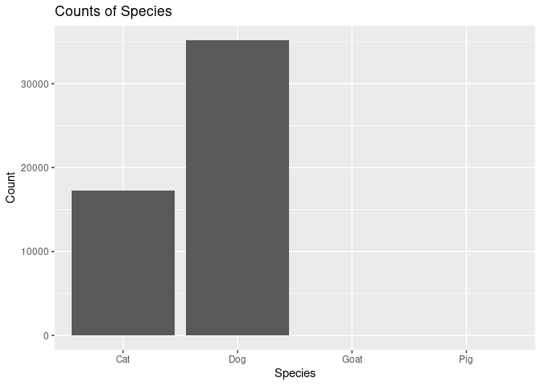
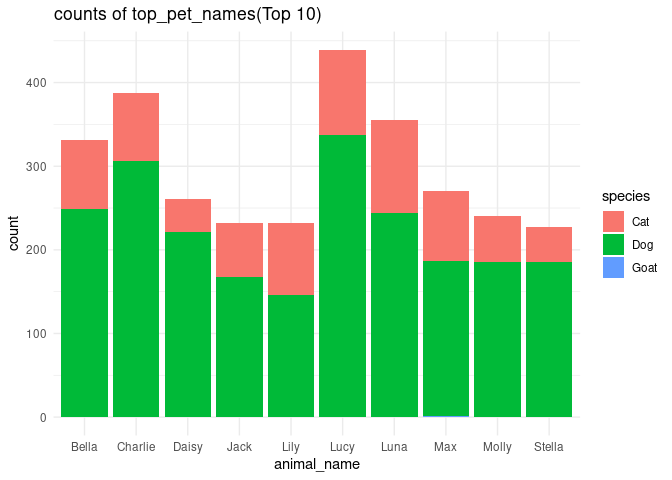

DSC 200 Lab Project -Term 2232
================
2024-05-20

**Student Name:<areej>**

**Student ID:\<2221004173\>**

**Deadline:** 23:59 on Sunday, 19 May 2024

**Total Points:** 20

## Loading Packages

``` r
library(tidyverse)
library(openintro)
library(ggrepel)
```

## Tasks

\`1. (2 points)

``` r
# Load the openintro package 
library(openintro)

# Loab the seattlepets dataset 
data("seattlepets")

# Number of pets in the dataset
num_pets <- nrow(seattlepets)
num_pets
```

    ## [1] 52519

Write your narrative here

\`2. (2 points)

``` r
# Number of variables in the dataset
num_variables <- ncol(seattlepets)
 num_variables
```

    ## [1] 7

Write your narrative below

\`3. (2 points)

``` r
# load necessary package
library(dplyr)

#Count the frequencies of each species
species_counts <- seattlepets %>%
 group_by(species) %>%
  summarise(count = n()) %>%
  arrange(desc(count))

species_counts
```

    ## # A tibble: 4 × 2
    ##   species count
    ##   <chr>   <int>
    ## 1 Dog     35181
    ## 2 Cat     17294
    ## 3 Goat       38
    ## 4 Pig         6

Write your narrative here

\`4. (2 points)

``` r
# Count the frequencies of each pet name
name_counts <- seattlepets %>%
  group_by(animal_name) %>%
  summarise(count = n()) %>%
  arrange(desc(count)) %>%
  head(10)

name_counts
```

    ## # A tibble: 10 × 2
    ##    animal_name count
    ##    <chr>       <int>
    ##  1 <NA>          483
    ##  2 Lucy          439
    ##  3 Charlie       387
    ##  4 Luna          355
    ##  5 Bella         331
    ##  6 Max           270
    ##  7 Daisy         261
    ##  8 Molly         240
    ##  9 Jack          232
    ## 10 Lily          232

Write your narrative here

\`5. (2 points)

``` r
# Retrieve and display recorde for species pig sorted by pet names
Pig_records <- seattlepets %>%
  filter(species == "Pig") %>%
  arrange(animal_name)

Pig_records
```

    ## # A tibble: 6 × 7
    ##   license_issue_date license_number animal_name species primary_breed
    ##   <date>             <chr>          <chr>       <chr>   <chr>        
    ## 1 2018-04-23         S116433        Atticus     Pig     Pot-Bellied  
    ## 2 2018-08-29         S146305        Coconut     Pig     Pot-Bellied  
    ## 3 2018-04-10         139975         Darla       Pig     Pot Bellied  
    ## 4 2018-07-27         731834         Millie      Pig     Pot-Bellied  
    ## 5 2018-08-29         S146306        Othello     Pig     Pot-Bellied  
    ## 6 2018-05-12         S141788        <NA>        Pig     Standard     
    ## # ℹ 2 more variables: secondary_breed <chr>, zip_code <chr>

Write your narrative here

\`6. (2 points)

``` r
# Retrieve and display the pet name and primary_breeds for species Goat 
goat_records <- seattlepets %>%
  filter(species == "Goat") %>%
  select(animal_name, primary_breed) %>%
  arrange(animal_name)

goat_records
```

    ## # A tibble: 38 × 2
    ##    animal_name     primary_breed
    ##    <chr>           <chr>        
    ##  1 Abelard         Miniature    
    ##  2 Aggie           Miniature    
    ##  3 Arya            Miniature    
    ##  4 Beans           Miniature    
    ##  5 Brussels Sprout Miniature    
    ##  6 Darcy           Miniature    
    ##  7 Fawn            Miniature    
    ##  8 Fiona           Miniature    
    ##  9 Gavin           Standard     
    ## 10 Grace           Miniature    
    ## # ℹ 28 more rows

Write your narrative here

\`7. (2 points)

``` r
merged_columns <- seattlepets %>% 
  mutate(pet=paste(animal_name,species,sep = ";")) %>%
  select(license_number,pet) %>%
  arrange(pet)
merged_columns
```

    ## # A tibble: 52,519 × 2
    ##    license_number pet                                   
    ##    <chr>          <chr>                                 
    ##  1 8001665        "\"Luci\" Lucia Rosalin Wicksugal;Dog"
    ##  2 896557         "\"Mama\" Maya;Cat"                   
    ##  3 S147119        "\"Mo\";Cat"                          
    ##  4 353597         "'Alani;Cat"                          
    ##  5 S143106        "'Murca;Dog"                          
    ##  6 573722         "-;Cat"                               
    ##  7 S126229        "1;Cat"                               
    ##  8 S126230        "2;Cat"                               
    ##  9 133239         "30 Weight;Cat"                       
    ## 10 S142492        "7's;Dog"                             
    ## # ℹ 52,509 more rows

Write your narrative here

\`8. (2 points)

``` r
library(ggplot2)

#Create a bar plot of species counts 
species_plot <- ggplot(seattlepets, aes(x= species)) +
  geom_bar() +
  labs(title = "Counts of Species", x = "Species", y = "Count")
theme(axis.text.x = element_text(angle = 45, hjust = 1))
```

    ## List of 1
    ##  $ axis.text.x:List of 11
    ##   ..$ family       : NULL
    ##   ..$ face         : NULL
    ##   ..$ colour       : NULL
    ##   ..$ size         : NULL
    ##   ..$ hjust        : num 1
    ##   ..$ vjust        : NULL
    ##   ..$ angle        : num 45
    ##   ..$ lineheight   : NULL
    ##   ..$ margin       : NULL
    ##   ..$ debug        : NULL
    ##   ..$ inherit.blank: logi FALSE
    ##   ..- attr(*, "class")= chr [1:2] "element_text" "element"
    ##  - attr(*, "class")= chr [1:2] "theme" "gg"
    ##  - attr(*, "complete")= logi FALSE
    ##  - attr(*, "validate")= logi TRUE

``` r
#Display the plot
print(species_plot)
```

<!-- -->

``` r
# v
```

Write your narrative here

\`9. (2 points)

``` r
top_10_names <- seattlepets %>% 
filter(animal_name %in% c( "Lucy"  , "Charlie" , "Luna" , "Bella" , "Max"    , 
                           "Daisy" , "Molly"   , "Jack" , "Lily"  , "Stella" ))
top_10_names
```

    ## # A tibble: 2,974 × 7
    ##    license_issue_date license_number animal_name species primary_breed          
    ##    <date>             <chr>          <chr>       <chr>   <chr>                  
    ##  1 2018-11-25         S120480        Charlie     Dog     Retriever, Labrador    
    ##  2 2018-11-03         829563         Max         Dog     Retriever, Labrador    
    ##  3 2018-10-29         732106         Lily        Cat     Domestic Shorthair     
    ##  4 2018-11-25         895808         Max         Cat     Domestic Shorthair     
    ##  5 2018-11-26         834841         Daisy       Dog     Terrier, American Pit …
    ##  6 2018-12-13         8003804        Charlie     Dog     Border Collie          
    ##  7 2018-11-06         S125292        Jack        Cat     Domestic Shorthair     
    ##  8 2018-11-01         835179         Stella      Dog     Retriever, Labrador    
    ##  9 2018-12-14         950094         Molly       Dog     Retriever, Labrador    
    ## 10 2018-11-24         S137301        Lucy        Dog     Hound                  
    ## # ℹ 2,964 more rows
    ## # ℹ 2 more variables: secondary_breed <chr>, zip_code <chr>

\`a. What does the above code chunk do? This code defines a vector
top_10_names that contiains the 10 most common pet names identified in
Task 4. This list will be used to filter and analyze the dataset for
these specific pet names

\`b. Plot the counts of the pet names (animal_name) in top_10_names

``` r
ggplot(top_10_names,aes(x = animal_name, fill = species)) +
  geom_bar() +
  labs(x = "animal_name",y = "count") +
  ggtitle("counts of top_pet_names(Top 10)") +
  theme_minimal()
```

<!-- -->

\`10. (2 points)

\`The below code plots the proportion of dogs with a given name versus
the proportion of cats with the same name. The 20 most common cat and
dog names are displayed. The diagonal line on the plot is the x = y
line; if a name appeared on this line, the name’s popularity would be
exactly the same for dogs and cats.

    ## Warning: Using `size` aesthetic for lines was deprecated in ggplot2 3.4.0.
    ## ℹ Please use `linewidth` instead.
    ## This warning is displayed once every 8 hours.
    ## Call `lifecycle::last_lifecycle_warnings()` to see where this warning was
    ## generated.

    ## Warning in geom_image(mapping, data, inherit.aes = inherit.aes, na.rm = na.rm, : All aesthetics have length 1, but the data has 20 rows.
    ## ℹ Please consider using `annotate()` or provide this layer with data containing
    ##   a single row.
    ## All aesthetics have length 1, but the data has 20 rows.
    ## ℹ Please consider using `annotate()` or provide this layer with data containing
    ##   a single row.

<!-- -->

\`What names are more common for cats than dogs? The ones above the line
or the ones below the line?

\`Answer here The name that are more common for cats than dogs are the
ones above the diagonal liner (x = y) on the plot

’ (proportion of cats with a given name and proportion of dogs with a
given name) positive or negative? What does this mean in context of the
data?

\`Answer here The relationship between the proprtion of cats with a
given name and the propotion of dogs with the same name is negative. In
the context of the data, this negtive relationship means that as the
proportion of cats with a given name increases, the proportion of dogs
with the sames names tends to decrease, and vice versa. this suggests an
inverse relationship in the popularity of names between cats and dogs in
the datase
